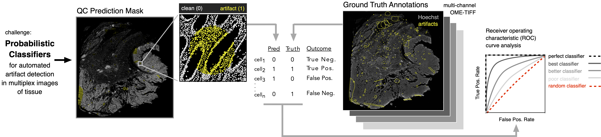

# Automated Detection of Microscopy Artifacts

## Description
Multiplex images of tissue contain information on the gene expression, morphology, and spatial distribution of individual cells comprising biologically specialized niches. However, accurate extraction of cell-level features from pixel-level data is hindered by the presence of microscopy artifacts. Manual curation of noisy cell segmentation instances scales poorly with increasing dataset size, and methods capable of automated artifact detection are needed to enhance workflow efficiency, minimize curator burden, and mitigate human bias. In this challenge, participants will draw on classical and/or machine learning approaches to develop probabilistic classifiers for detecting cell segmentation instances in multiplex images of tissue corrupted by microscopy artifacts.



## Dataset
Test data for this challenge will consist of a single 1.6cm<sup>2</sup> section of primary human colorectal adenocarcinoma probed for 21 tumor, immune, and stromal markers over 8 rounds of multiplex immunofluorescence imaging by [CyCIF](https://www.cycif.org/). The dataset was collected as part of the Human Tumor Atlas Network (HTAN) and is referred to as the SARDANA-097 image.

Multiclass quality control (QC) annotations flagging microscopy artifacts present throughtout the multiple channels constituting the SARDANA-097 image have been manually curated and provided as a reference for model training. These an other data files pertinent to this hackathon challenge can be found at the Sage Synapse data repository under [Synapse ID: syn26848598](https://www.synapse.org/#!Synapse:syn26848598).

Data files and descriptions:

<pre>
<b>01-artifacts</b>  
│
└───<b>csv</b>
│   │   ReadMe.txt
│   │   unmicst-WD-76845-097_cellRing.csv
│
└───<b>markers</b>
│   │   markers.csv
│
└───<b>mask</b>
│   │   ReadMe.txt
│   │   cellRingMask.tif
│
└───<b>qc_masks</b>
│   │   ROI_table.csv
│   │   polygon_dict.pkl
│   │   qcmask_cell.tif
│   │   qcmask_pixel.tif
│   │   truth.csv
│
└───<b>seg</b>
│   │   ReadMe.txt
│   │   WD-76845-097.ome.tif
│
└───<b>tif</b>
│   │   ReadMe.txt
│   │   WD-76845-097.ome.tif
</pre>

* `csv/unmicst-WD-76845-097_cellRing.csv`: single-cell feature table containing cell IDs, spatial coordinates (x, y), integrated fluorescence signal intensities, and nuclear morphology attributes for the 1,242,756 cells constituting the SARDANA-097 image.
* `markers/markers.csv`: immunomarker metadata, maps immunomarkers to image channel number and CyCIF cycle number.
* `mask/WD-76845-097.ome.tif`: cell segmentation mask for the 1,242,756 cells comprising the SARDANA-097 image indexed 1 to N (0 reserved for background pixels).
* `qc/ROI_table.csv`: ROI metadata for multiple classes of artifacts in the SARDANA-097 image.
* `qc/polygon_dict.pkl`: shape type (ellipse or polygon) and vertice coordinates defining ROIs in `qc/ROI_table.csv`.
* `qc/qcmask_cell.csv`: cell segmentation mask annotated with multiclass artifact labels: 2=fluorescence aberration, 3=slide debris, 4=coverslip air bubble, 5=uneven immunolabeling, 6=image blur. Labels 0 and 1 are reserved for background pixels and artifact-free cells, respectively.  
* `qc/qcmask_pixel.csv`: Artifact ROI mask: 2=fluorescence aberration, 3=slide debris, 4=coverslip air bubble, 5=uneven immunolabeling, 6=image blur. Label 1 is reserved for pixels falling outside of an ROI.
* `qc/truth_binary.csv`: binary ground truth annotations for the 1,242,756 cells comprising the SARDANA-097 image (0=noisy, 1=clean).
* `qc/truth_multiclass.csv`: multiclass ground truth annotations for the 1,242,756 cells comprising the SARDANA-097 image (labels are those in `qc/qcmask_cell.csv`).
* `seg/WD-76845-097.ome.tif`: cell segmentation outlines defining cell boundaries.
* `tif/WD-76845-097.ome.tif`: stitched and registered 40-channel OME-TIFF file constituting the SARDANA-097 CyCIF image.

## Target Channels
The SARDANA-097 image comprises a total of 40 channels. However, artifacts were curated from only 21 of these channels, as several either contain signals from secondary antibodies alone or were otherwise deemed unsuitable for the purposes of this challenge. Please only consider the following channels:

```
'Hoechst0', 'anti_CD3', 'anti_CD45RO', 'Keratin_570', 'aSMA_660', 'CD4_488', 'CD45_PE', 'PD1_647', 'CD20_488', 'CD68_555', 'CD8a_660', 'CD163_488', 'FOXP3_570', 'PDL1_647', 'Ecad_488', 'Vimentin_555', 'CDX2_647', 'LaminABC_488',
'Desmin_555', 'CD31_647', 'PCNA_488', 'CollagenIV_647'
```

## Artifact Classes
Examples of different types of artifacts in the SARDANA-097 image:


## Classifier Output
Classifier output should consist of a CSV file containing probability scores for each of 6 classes of cells: 1=artifact-free, 2=fluorescence aberration, 3=slide debris, 4=coverslip air bubble, 5=uneven immunolabeling, 6=image blur and be formatted as follows:

```
CellID,1,2,3,4,5,6
1,0.95,0.23,0.14,0.05,0.39,0.21
2,0.10,0.09,0.56,0.67,0.89,0.01
3,0.03,0.28,0.22,0.17,0.42,0.91
.
.
.
```

## Performance Evaluation
Classifier predictions will be scored against binary (`qc/truth_binary.csv`) and multiclass (`qc/truth_multiclass.csv`) ground truth annotations using binary performance metrics of precision and recall and multiclass Receiver operating characteristic (ROC) curve analysis. Python scripts `pr.py` and `roc.py` in the `score` directory of this GitHub repository can be run at any time to assess model performance.

To score classifier predictions by multiclass Receiver Operating Characteristic (ROC) curve analysis, pass a multiclass predictions CSV table and `qc/truth_multiclass.csv` as ordered arguments to `roc.py` as follows:

```
$ python roc.py  pred_multiclass.csv truth_multiclass.csv
```


To score binary classifier predictions (1=noisy, 0=artifact-free), first threshold a table of multiclass probability scores reassigning resulting labels >=2 to the value 1 (i.e. noisy) and those equal to 1 to the value (0=artifact-free). Then pass the binary predictions CSV table and `qc/truth_binary.csv` as ordered arguments to `pr.py` as follows:

```
$ python pr.py pred_binary.csv truth_binary.csv

precision=0.78, recall=0.67
```

## Considerations
1. There is likely some degree in the ground truth labels themselves. How might classifiers be developed to be robust to artifact misclassification, artifact-free cells inadvertently classified as noisy (false positives), or artifacts which have gone unannotated (false negatives)?

2. Which leads to superior classifier performance, those which are trained on image-derived single-cell (`csv/unmicst-WD-76845-097_cellRing.csv`), or those which are trained directly on pixel-level data? Could advantages be realized by training models on both data types?

## Suggested Computational Resources and Software Packages
* High-level programming language (Python 3 is recommended)
* Core data science software packages (e.g. `pandas`, `numpy`, and `scipy`); libraries for reading, writing, analyzing, and visualizing multi-channel TIFF images (e.g. `tifffile`, `skimage`, `matplotlib`, `napari`); and machine learning and artificial intelligence libraries (e.g. `scikit-learn`, `tensorflow`, `keras`, `pytorch`).

If using Python 3, all of the aforementioned libraries can be installed in a fresh Python virtual environment dedicated to this hackathon challenge by running the following commands (on Mac):

```
$ python3 -m venv ~/artifacts  # Creates a new Python virtual environment in home directory
$ source ~/artifacts/bin/activate  # Steps into the newly created virtual environment
$ pip install -r requirements.txt  # Installs software packages using the "requirements.txt" file in this GitHub repo
```

## Team Check-In Times
Virtual check-ins will occur daily at **10am** & **3pm** ([US EST](https://dateful.com/time-zone-converter)) at the following Zoom link:
* https://us02web.zoom.us/j/84722597891?pwd=aVR5VkhBN1hsRHIrRFpTblhzMTI0Zz09.

For questions outside of check-in times, please post to the #01-artifacts Slack channel.
