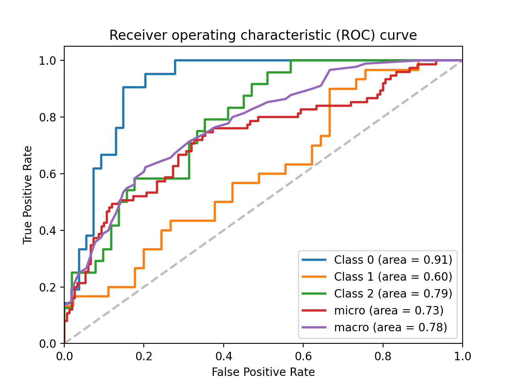

# Automated Detection of Microscopy Artifacts

## Description
Multiplex images of tissue contain information on the gene expression, morphology, and spatial distribution of individual cells comprising biologically specialized niches. However, accurate extraction of cell-level features from pixel-level data is hindered by the presence of microscopy artifacts. Manual curation of noisy cell segmentation instances scales poorly with increasing dataset size, and methods capable of automated artifact detection are needed to enhance workflow efficiency, minimize curator burden, and mitigate human bias. In this challenge, participants will draw on classical and/or machine learning approaches to develop probabilistic classifiers for detecting cell segmentation instances in multiplex images of tissue corrupted by microscopy artifacts.


## Data
Test data for this challenge consists of a single 1.6cm<sup>2</sup> section of primary human colorectal adenocarcinoma probed for 21 different tumor, immune, and stromal markers over 8 rounds of t-CyCIF multiplex fluorescence imaging. This dataset, collected as part of the Human Tumor Atlas Network (HTAN), is referred to as SARDANA-097 image consists of a stitched, registered, and segmented 40-channel OME-TIFF pyramid file and corresponding single-cell data for 1,242,756 cells constituting the tissue.

Pixel and cell-level ground truth QC masks detailing multiple classes of microscopy artifacts affecting this multi-channel image have been manually curated and are provided for model training.

All requisite data files for this challenge are available at the Sage Synapse data repository under Synapse ID syn26848598. The following data files are available:

<pre>
<b>01-artifacts</b>  
│
└───<b>csv</b>
│   │   ReadMe.txt
│   │   unmicst-WD-76845-097_cellRing.csv
│
└───<b>markers</b>
│   │   markers.csv
│
└───<b>mask</b>
│   │   ReadMe.txt
│   │   cellRingMask.tif
│
└───<b>qc_masks</b>
│   │   ROI_table.csv
│   │   polygon_dict.pkl
│   │   qcmask_cell.tif
│   │   qcmask_pixel.tif
│
└───<b>score</b>
│   │   pr.py
│   │   roc.py
│   │   truth.csv
│
└───<b>seg</b>
│   │   ReadMe.txt
│   │   WD-76845-097.ome.tif
│
└───<b>tif</b>
│   │   ReadMe.txt
│   │   WD-76845-097.ome.tif
</pre>

File descriptions:
* `csv/unmicst-WD-76845-097_cellRing.csv`: single-cell feature table (CSV format) containing cell IDs, spatial coordinates, integrated fluorescence signal intensities, and nuclear morphology features for 1,242,756 cells constituting the SARDANA-097 image
* `markers/markers.csv`: channel-cycle-marker mapping for SARDANA-097 t-CyCIF image
* `mask/WD-76845-097.ome.tif`: cell segmentation mask for SARDANA-097 image
* `qc/ROI_table.csv`: ROI metadata for defining regions of tissue affected by different microscopy artifacts in the SARDANA-097 image
* `qc/polygon_dict.pkl`: Python pickle file containing shape types (ellipse or polygon) and pixel coordinates of vertices defining artifact ROIs specified in `qc/ROI_table.csv`
* `qc/qcmask_cell.csv`: multiclass QC annotations at the single-cell level
* `qc/qcmask_pixel.csv`: multiclass QC annotations at the pixel level
* `score/pr.py`: Python script for computing precision and recall on binary classification relative to ground truth labels (`score/truth.csv`)
* `score/roc.py`: Python script for performing multiclass Receiver Operating Characteristic (ROC) curve analysis
* `score/truth.csv`: Table of multiclass ground truth annotations for classification relative to ground truth labels for 1,242,756 cells comprising the SARDANA-097 image
* `seg/WD-76845-097.ome.tif`: cell segmentation outlines for the SARDANA-097 image
* `tif/WD-76845-097.ome.tif`: 40-channel, OME-TIFF pyramid file for the SARDANA-097 image

## Expected Output
Classifier output will consist of CSV data tables consisting of probability scores for whether each cell comprising the SARDANA-097 image (1,242,756) is corrupted by one of 6 classes (1=clean; 2-6=one of multiple artifact classes) along with their Cell IDs. Column headers should be formatted as follows: `CellID`, `1`, `2`, `3`, `4`, `5`, `6`.

## Performance Evaluation
Multiclass classifier predictions will be scored relative to ground truth annotations using a combination of Receiver operating characteristic (ROC) curve analysis and binary performance metrics precision and recall using the following scripts: `pr.py` and `roc.py`.

```
$ python roc.py  multiclass.csv truth.csv
```



```
$ python pr.py pred.csv truth.csv
precision=0.78, recall=0.67
```

## Suggested Computational Resources and Software Packages
* High-level programming language (Python is recommended)
* Data analysis software libraries such as `pandas`, `numpy`, `scipy`
* Software libraries for reading, writing, analyzing, and visualizing multi-channel image files such as `tifffile`, `skimage`, `matplotlib`, `napari`
* Machine learning and artificial intelligence libraries such as `scikit-learn`, `tensorflow`, `keras`, `pytorch`
* access to a GPU
